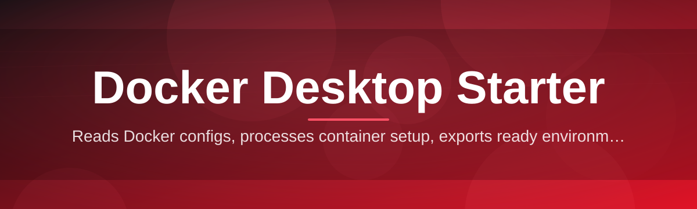
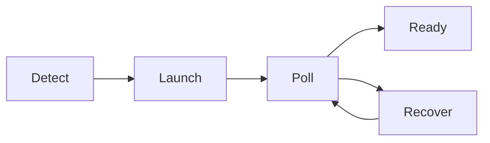

# docker-desktop-starter-tool 🐳⚡

  

*One click. One daemon. Zero yak-shaving — Docker Desktop, finally starting on your terms.*

  

## 🧭 Overview

Docker Desktop is powerful, but the boot sequence has always been a black box — a spinning whale icon, a silent wait, and a prayer that the daemon actually comes up before your terminal times out. **docker-desktop-starter-tool** exists to turn that black box into a transparent, controllable, and repeatable process. It sits between you and the Docker Desktop daemon, orchestrating startup, watching for readiness signals, and giving you a real interface instead of a taskbar icon and hope.

This project was born out of a simple frustration: developers restart Docker Desktop dozens of times a week — after sleep, after updates, after WSL2 hiccups — and every restart is a manual, click-and-wait ritual. We wanted a tool that treats "starting Docker" as a first-class workflow, with status, logs, retries, and shortcuts, rather than an afterthought buried in a system tray menu.

It's built for backend engineers, DevOps folks, students learning containers, and anyone who touches `docker-compose` more than twice a day. Whether you're spinning up a single container or bootstrapping an entire local microservices stack, this Docker Desktop Starter gets the daemon healthy and out of your way — fast, visibly, and consistently.

---

## 🔥 What It Actually Does

- **Instant daemon ignition** — launches Docker Desktop from a cold state without you touching the taskbar, and detects if it's already half-awake.

- **Readiness polling, not guesswork** — continuously checks the Docker Engine socket instead of assuming a fixed wait time, so you're never left running commands against a dead daemon.

- **Silent-fail rescue** — catches the classic "Docker Desktop stopped responding" freeze and offers a guided restart path instead of forcing you to kill processes manually.

- **WSL2 backend awareness** — understands the WSL2 integration layer and flags common misconfigurations (like a stalled `wsl.exe` subprocess) before they waste your morning.

- **One-shortcut launch** — a single global hotkey brings Docker Desktop from "not running" to "ready for `docker ps`" without opening a single menu.

- **Session memory** — remembers your last known-good startup configuration, so recovering from a bad reboot doesn't mean reconfiguring from scratch.

- **Lightweight tray presence** — a minimal, low-overhead tray companion that reports true engine status, not just "the app window opened."

- **Zero telemetry footprint** — everything runs locally; no accounts, no phone-home, no cloud dependency to start a local tool.

> [!NOTE]
> This tool orchestrates and monitors Docker Desktop — it does not replace it. Docker Desktop must be installed on your machine.

---

## 🚀 Getting Started

1. **Visit the landing page** using the download button above or below.

2. **Grab the latest release** — a single standalone executable, no installer wizard, no bundled bloat.

3. **Run it once** — the tool auto-detects your existing Docker Desktop installation and WSL2 configuration.

4. **Pin it, hotkey it, forget the tray icon** — from here on, starting Docker is one click or one keystroke away.

> [!TIP]
> Drop a shortcut in your Startup folder if you want Docker Desktop primed and ready before your IDE even opens.

---

## 💻 System Requirements

| Requirement | Details |
|---|---|
| OS | Windows 10 (21H2+) or Windows 11 |
| Architecture | x64 |
| Docker Desktop | Must be installed separately |
| Dependencies | None — standalone binary |
| Disk space | < 20 MB |
| Admin rights | Not required for normal operation |

> [!IMPORTANT]
> This is a Windows-native utility. macOS and Linux users should rely on their platform's native Docker Desktop lifecycle tools — this project does not target those systems.

---

## ⚙️ How It Works

The tool operates as a thin, watchful layer above the Docker Desktop process tree:

1. **Detect** — checks whether the Docker Desktop process and WSL2 backend are already running.

2. **Launch** — if not running, spawns Docker Desktop using its native executable path.

3. **Poll** — repeatedly pings the Docker Engine socket until it responds successfully.

4. **Report** — updates the tray icon and UI with a real "ready" state, not a guessed one.

5. **Recover** — if polling times out, offers a guided restart instead of failing silently.

---

## 🧩 Troubleshooting

**Q: The tool says "starting" forever — is it stuck?**
A: Usually the WSL2 backend is slow to initialize on cold boot. Give it 60–90 seconds; if it doesn't resolve, use the built-in Recover action.

**Q: Docker Desktop opens but the engine never goes ready.**
A: Check that virtualization is enabled in BIOS/UEFI and that the WSL2 kernel component is up to date — the starter tool cannot fix disabled virtualization.

**Q: My antivirus flagged the executable.**
A: Standalone, unsigned automation tools sometimes trigger heuristic flags. Verify the download came from the official landing page linked in this README.

**Q: The hotkey doesn't respond.**
A: Another app may already be bound to that key combination. Rebind it from the tool's settings panel.

**Q: Does this tool modify Docker Desktop's own settings?**
A: No — it only observes and launches. All Docker Desktop configuration remains untouched.

**Q: Can I run multiple instances of the starter tool?**
A: Not recommended — a single instance is designed to own the monitoring loop cleanly.

---

## 🎨 UI / UX Details

<strong>Keyboard shortcuts</strong>

| Action | Shortcut |
|---|---|
| Start Docker Desktop | `Ctrl + Alt + D` |
| Open status panel | `Ctrl + Alt + S` |
| Force recover | `Ctrl + Alt + R` |
| Quit tray companion | `Ctrl + Alt + Q` |

<strong>Themes and settings</strong>

- Light, Dark, and System-sync themes

- Adjustable polling interval (1s–10s)

- Optional startup sound on "ready" state

- Configurable retry limit before recovery prompt

> [!TIP]
> The status panel color-codes engine health: gray (idle), amber (starting), green (ready), red (needs recovery).

---

## 🤝 Contributing & Community

Issues, feature ideas, and pull requests are genuinely welcome — this project grew from real developer pain, and it stays sharp because people report what actually breaks on their machines.

- Open an issue with your Windows build, Docker Desktop version, and WSL2 status for fastest triage.

- Small, focused pull requests merge faster than sprawling ones.

- Discussions are the right place for workflow ideas before they become code.

  

---

## 📄 License

Released under the [MIT License](LICENSE), 2026. Use it, fork it, ship it inside your own tooling — just keep the license notice intact.

---

## ⚠️ Disclaimer

> [!WARNING]
> This tool automates the *launching and monitoring* of Docker Desktop only. It is an independent, community-built utility and is not affiliated with, endorsed by, or officially connected to Docker, Inc. Use it at your own discretion, and always keep Docker Desktop itself updated through official channels.

---

